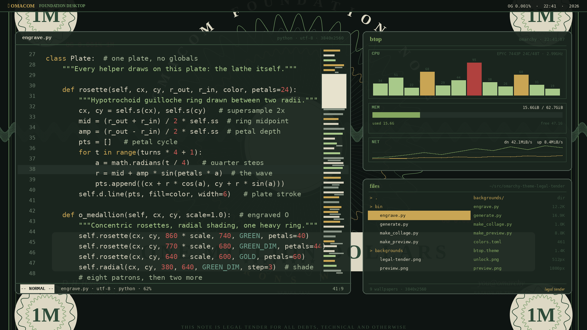
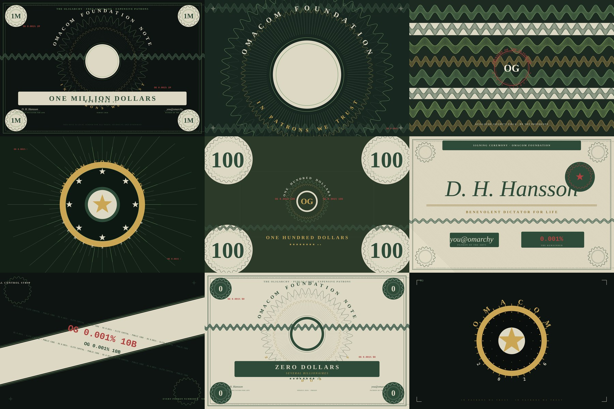

# Legal Tender

A dark theme for [Omarchy](https://omarchy.org). Old bank notes guide the look. Each scene uses green, cream, gold, and red.





Nine views show the full note. The rest move in close. They focus on the seal, fine lines, names, serials, stars, and cream proof.

## Install

```bash
omarchy theme install https://github.com/joshuaswarren/omarchy-theme-legal-tender
```

## Palette

| Role | Hex |
| --- | --- |
| Backdrop | `#0e1411`. |
| Dark | `#18211c`. |
| Text | `#d6d1bd`. |
| Gold | `#c9a554`. |
| Green | `#85a760`. |
| Red | `#b0413e`. |
| Blue | `#5b7fa6`. |
| Dim | `#4c5a50`. |

See [`colors.toml`](colors.toml) for the full ANSI set. Icons use `Yaru-olive`.
