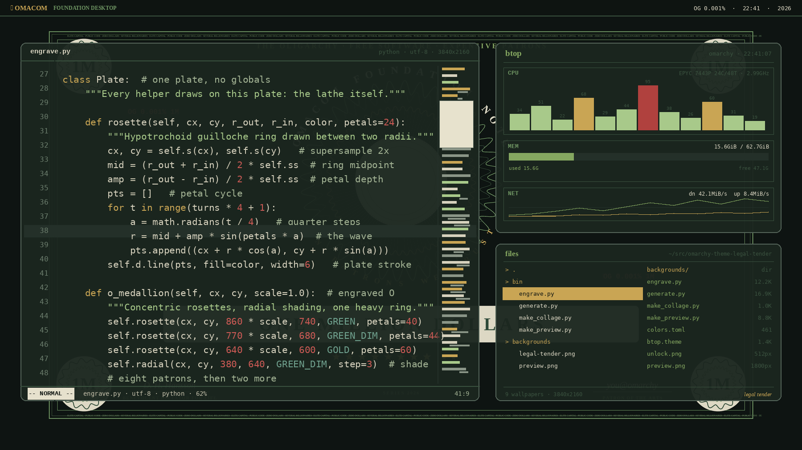
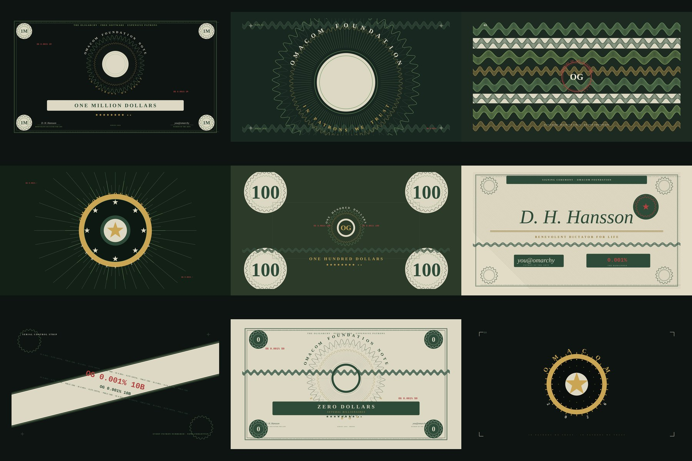

# Legal Tender

[](https://github.com/sponsors/joshuaswarren)

A dark theme for [Omarchy](https://omarchy.org). Old bank notes guide the look. Each scene uses green, cream, gold, and red.





Nine views show the full note. The rest move in close. They focus on the seal, fine lines, names, serials, stars, and cream proof.

## Install

```bash
omarchy theme install https://github.com/joshuaswarren/omarchy-theme-legal-tender
```

## Palette

| Role | Hex |
| --- | --- |
| Backdrop | `#0e1411`. |
| Dark | `#18211c`. |
| Text | `#d6d1bd`. |
| Gold | `#c9a554`. |
| Green | `#85a760`. |
| Red | `#b0413e`. |
| Blue | `#5b7fa6`. |
| Dim | `#4c5a50`. |

See [`colors.toml`](colors.toml) for the full ANSI set. Icons use `Yaru-olive`.

## Support

Every bit of support helps keep omarchy-theme-legal-tender alive and free. If you are able, [sponsor on GitHub](https://github.com/sponsors/joshuaswarren) or send a Lightning donation to `joshuaswarren@strike.me` to directly fund continued development and new integrations.

[](https://github.com/sponsors/joshuaswarren)

If financial support is not an option, you can still make a big difference: [star the repo](https://github.com/joshuaswarren/omarchy-theme-legal-tender), share it, or recommend it to a colleague. Word of mouth is how most people find omarchy-theme-legal-tender.
